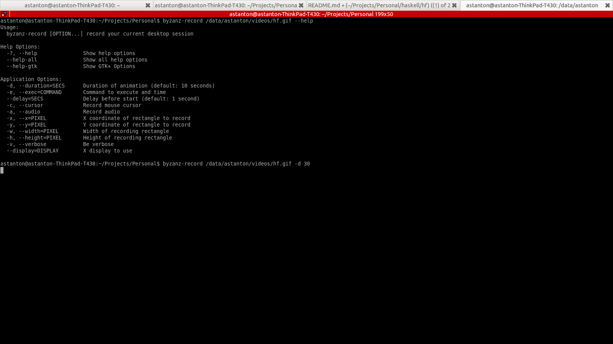

Haskell Find
=====

A simple command line utility that allows filtering for an input on a set of keystrokes.

Install
-------

You'll need to have the ncursesw library installed, which will vary from operating system to operating system.

`cabal build` or `cabal install` should be sufficient after setting up the sandbox.

To Use
------

Using _hf_ is simple: simply pipe input into hf:

    find . -type f | hf

and start typing

The Up/Down (or Alt-P/Alt-N) keys selects which file to open.  Enter opens selects the highlighted file. 

Sometimes a single query isn't enough to differentiate between the files.  By pressing Tab, _hf_ will add another 'searcher' query for additional filtering.

There are currently two modes of searching: substring and slop, both with case sensitive varieties:
    

Enter selects the current item.

